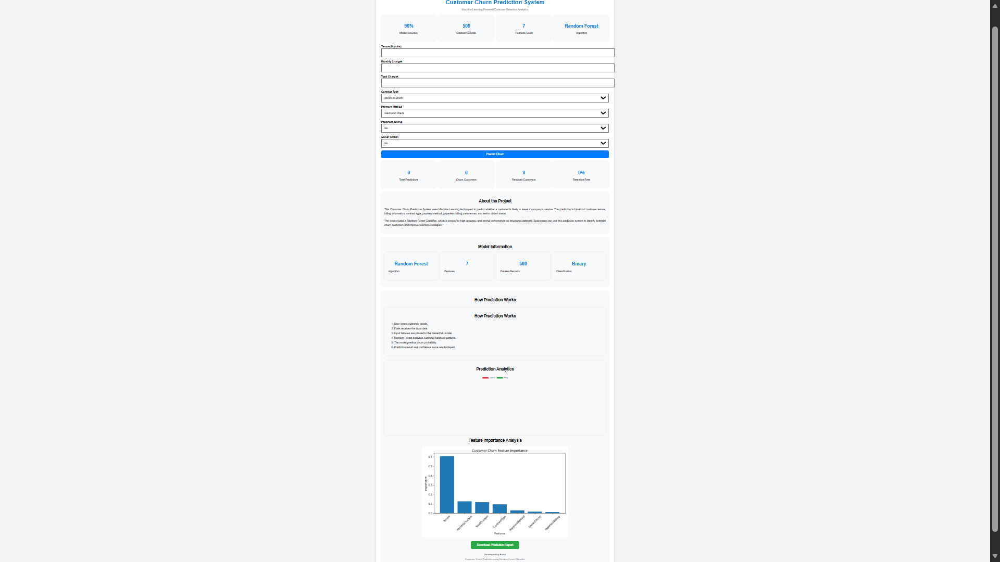
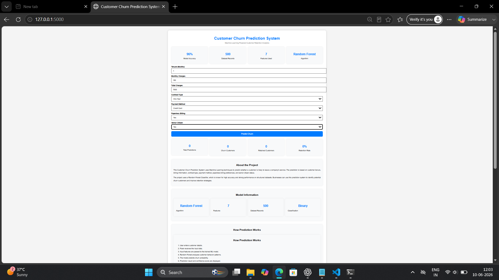
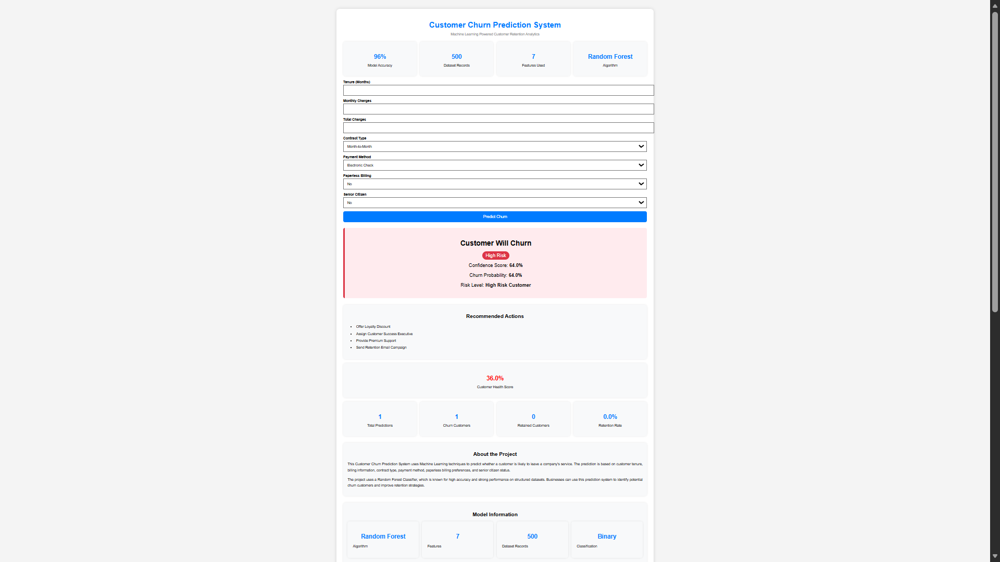
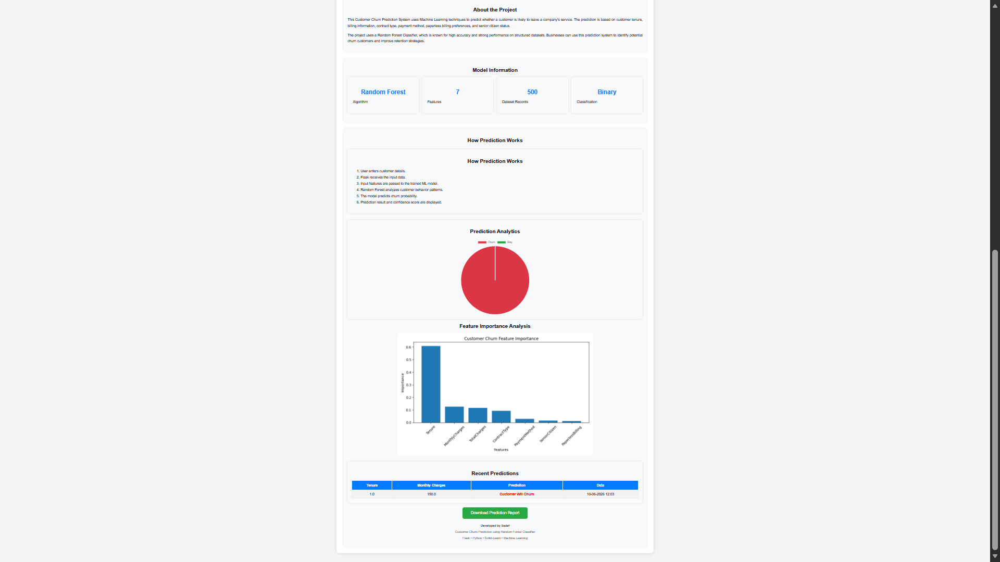

# Customer Churn Prediction System 


A Machine Learning powered web application that predicts customer churn using a Random Forest Classifier and provides retention insights through an interactive analytics dashboard.

---

## Business Problem

Customer churn is one of the biggest challenges for subscription-based businesses.

This project predicts whether a customer is likely to leave a service using Machine Learning. Businesses can use these predictions to identify high-risk customers and take proactive retention actions.

---

## Dataset Information

The project uses a customer churn dataset containing 500 customer records from a subscription-based service environment.

### Features Used

| Feature | Description |
|----------|-------------|
| Tenure | Customer subscription duration |
| MonthlyCharges | Monthly service charges |
| TotalCharges | Total amount paid by customer |
| Contract | Type of customer contract |
| PaymentMethod | Payment method used |
| PaperlessBilling | Billing preference |
| SeniorCitizen | Senior citizen indicator |
| Churn | Target variable (0 = Stay, 1 = Leave) |

The objective is to predict whether a customer is likely to discontinue the service based on these attributes.
---

## Features :

- Customer Churn Prediction
- Confidence Score
- Churn Probability
- Risk Level Classification
- Customer Health Score
- Recommendation Engine
- Prediction Analytics Dashboard
- Feature Importance Visualization
- Prediction History Tracking
- CSV Report Download

---

## Tech Stack :

### Backend :
- Python
- Flask

### Machine Learning :
- Scikit-Learn
- NumPy
- Joblib

### Frontend :
- HTML
- CSS
- Chart.js

---

## Machine Learning Model :

| Property | Value |
|-----------|---------|
| Algorithm | Random Forest Classifier |
| Problem Type | Binary Classification |
| Features | 7 |
| Dataset Records | 500 |
| Accuracy | 96% |

---

## Why Random Forest?

Random Forest Classifier was selected because it provides strong performance on structured datasets and reduces overfitting through ensemble learning.

Advantages of Random Forest:

- Handles numerical and categorical features effectively
- Provides high classification accuracy
- Reduces overfitting
- Generates feature importance scores
- Performs well on customer behavior datasets

The model learns patterns from historical customer data and predicts churn probability for new customers.

---

## Machine Learning Workflow

### Step 1: Data Collection

Customer churn data was collected and stored in CSV format.

### Step 2: Data Preprocessing

The dataset was prepared for machine learning by:

- Handling categorical variables
- Feature encoding
- Data validation
- Train-test splitting

### Step 3: Model Training

The processed data was used to train a Random Forest Classifier.

### Step 4: Model Evaluation

The trained model was evaluated using classification metrics to measure prediction performance and reliability.

### Step 5: Deployment

The model was integrated into a Flask web application and deployed on Render for real-time usage.

---

## Project Structure

```text
Customer-Churn-Prediction
│
├── app.py
├── requirements.txt
├── README.md
│
├── models
│   └── churn_model.pkl
│
├── templates
│   └── index.html
│
├── static
│   └── feature_importance.png
│
└── screenshots
    ├── home.png
    ├── churn_prediction.png
    ├── dashboard.png
    └── analytics.png
```
---

## Installation :

### Clone Repository

```bash
git clone https://github.com/YOUR_USERNAME/Customer-Churn-Prediction.git
cd Customer-Churn-Prediction
```

### Install Dependencies

```bash
pip install -r requirements.txt
```

### Run Application

```bash
python app.py
```

### Open Browser

```text
http://127.0.0.1:5000
```

---

## Screenshots :

### Home Page



---

### Churn Prediction Result



---

### Analytics Dashboard



---

### Feature Importance



---

## Business Impact

Customer churn directly affects organizational revenue and growth.

This system helps businesses:

- Identify high-risk customers
- Improve customer retention
- Reduce revenue loss
- Support proactive decision-making
- Enhance customer relationship management

The project demonstrates how machine learning can be applied to solve real-world business challenges.

---

## Future Enhancements :

- User Authentication
- Database Integration
- Real-Time Predictions
- Cloud Deployment
- Advanced Customer Analytics
- Multiple Machine Learning Models

---

## Author

**Sadaf**

Customer Churn Prediction using Random Forest Classifier

Python • Flask • Scikit-Learn • Machine Learning

